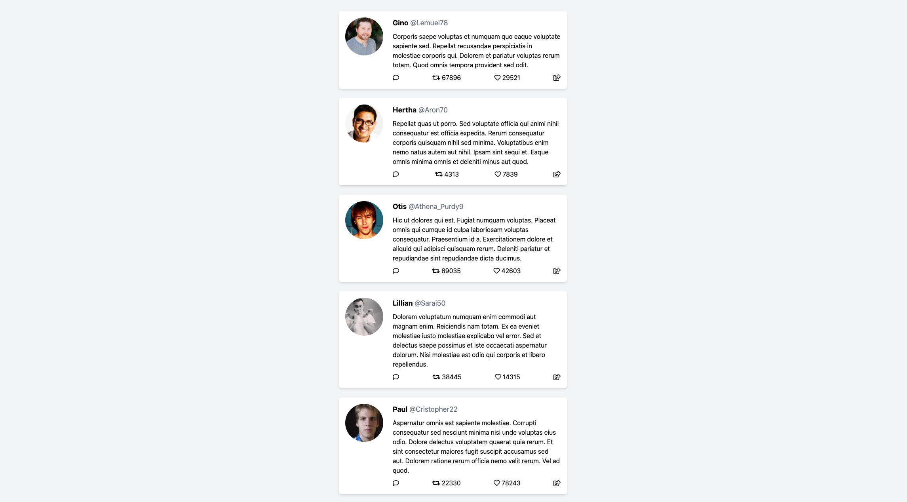

# Twitter frontend

This is a twitter clone; aimed to showcase a typescript react app.

## Available Scripts

In the project directory, you can run:

- `yarn start`: runs the app in the development mode.
- `yarn test`: launches the test runner in the interactive watch mode.
- `yarn build`: builds the app for production to the `build` folder.
- `docker-compose up`: starts mocks for the backend

## Technologies
- react
- typescript
- tailwind.css

## ToDo
- [ ] error handling
- [ ] loading animations
- [ ] auth/jwt
